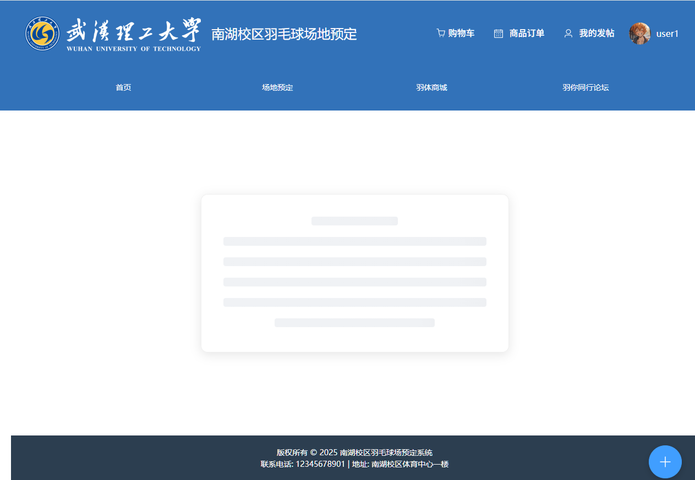
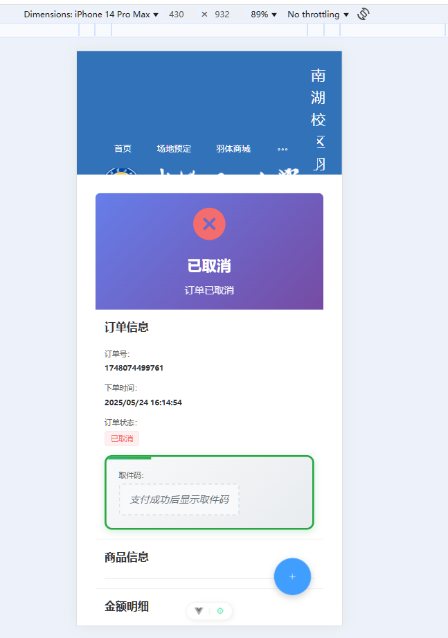
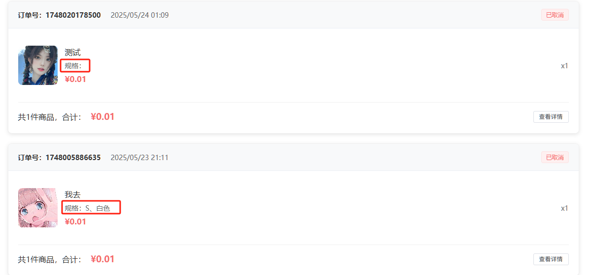
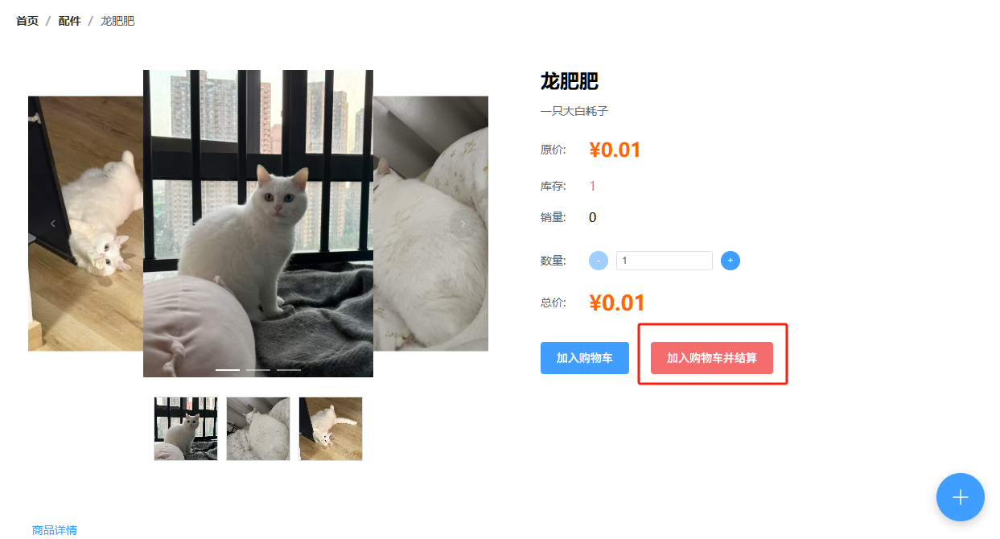
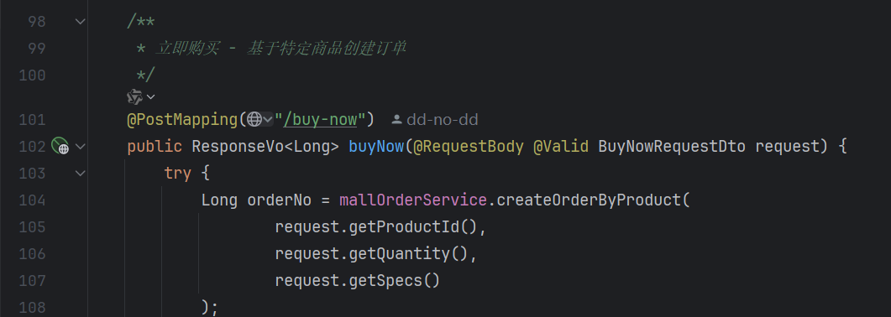

- [ ] 订单取消之后做页面跳转 跳转到订单列表界面

- [ ] 导航栏响应式布局有问题

- [ ] 订单列表页面 如果规格为null 则不显示

- [ ] 加入购物车并购买控件改名为立即购买
不需要加入购物车 直接创建订单
调用后端接口orders/buy-now

- [ ] 订单取消status应该是30而不是0
订单状态：10-未付款，20-已付款，30-已取消，40-已完成，50-已关闭
- [ ] 订单管理员管理界面 这里后来需要和预约订单整合 通过控件选择是预约订单还是商城订单
1. 管理员查看所有订单列表
接口路径: GET /api/mall/orders/admin
功能: 查看所有用户的订单列表
支持搜索:
按用户名搜索 (username参数)
按订单号搜索 (orderNo参数)
分页支持: pageNum和pageSize参数
权限控制: 需要ADMIN角色
2. 管理员关闭订单
接口路径: POST /api/mall/orders/admin/{orderNo}/close
功能: 管理员可以关闭订单（用于线下退款等场景）
状态限制: 只能关闭未付款(10)或已付款(20)的订单
结果: 订单状态变更为已关闭(50)
3. 管理员验证提货码完成订单
接口路径: POST /api/mall/orders/admin/{orderNo}/complete
功能: 验证提货码后将订单标记为已完成
参数: pickupCode - 提货码
状态限制: 只能完成已付款(20)的订单
验证: 必须提供正确的提货码
结果: 订单状态变更为已完成(40)